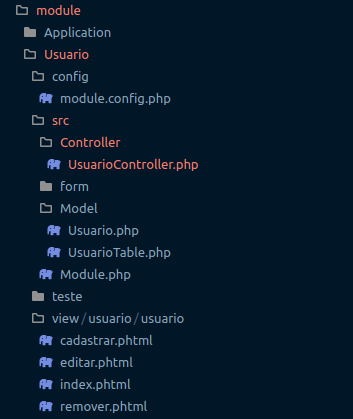
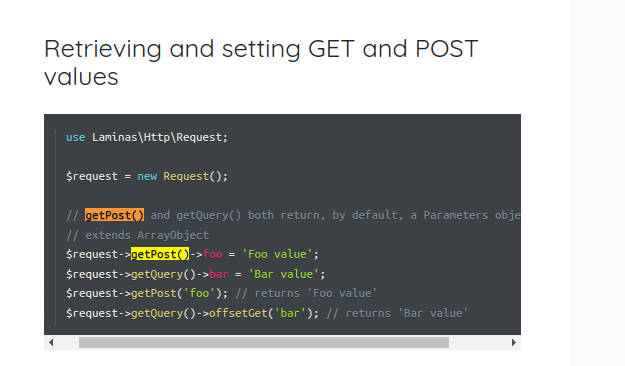
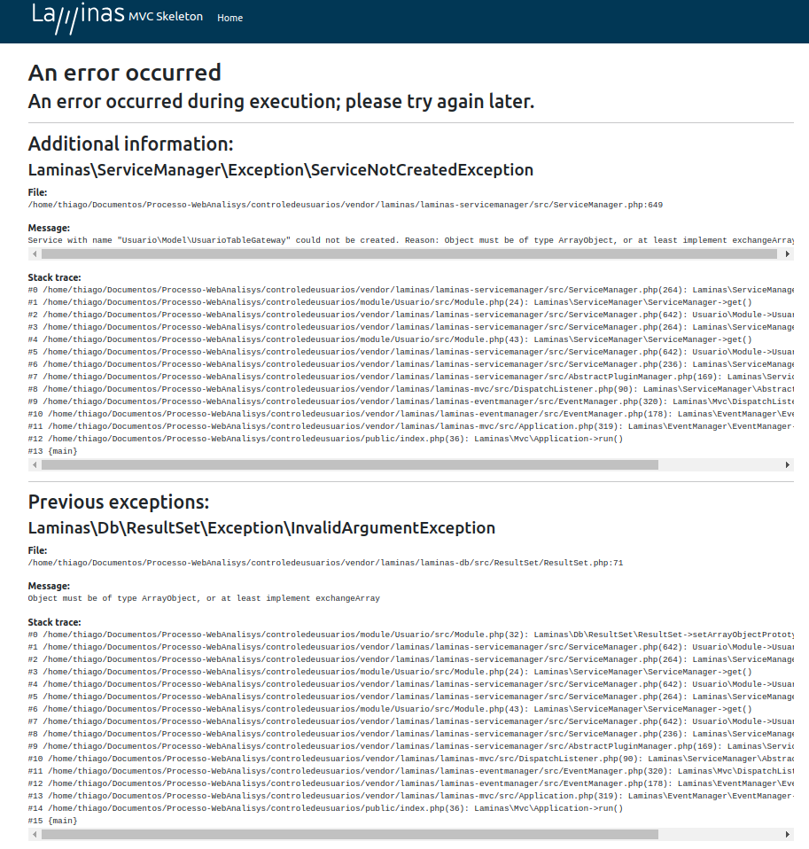
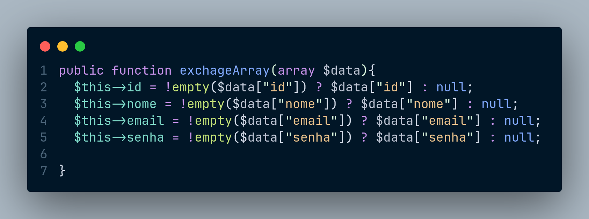

# Bem-vindo à minha resolução do desafio da WebAnalisys

## Como Utilizar

**1. Clone ou baixe este repositório conforme sua preferência.**

**2. Instale as dependências do Composer utilizando o comando abaixo:**

```
composer install
```
**3. Na pasta do projeto, utilize o comando abaixo:**

```
composer serve
```

## Descrição do desafio: 🚀

Neste desafio, solicitamos que você crie um repositório no GitHub e organize o desenvolvimento em diversos commits. Evite criar páginas desnecessárias além do que foi solicitado, e não se preocupe com questões visuais, pois a análise se concentrará no código fonte. Não se esqueça de enviar o arquivo SQL do banco de dados. 📁

Objetivo: 🎯

Desenvolver um sistema CRUD para controle de usuários utilizando o Laminas Framework. A página de listagem deve permitir buscar por nome. Os dados do usuário devem incluir nome, e-mail e senha, sendo esta última armazenada de forma criptografada. 🔐

Checklist: ✅
- Tabela de usuários
- Estrutura do Laminas
- Página de listagem de usuários
- Funcionalidade de busca na página de listagem de usuários
- Página de cadastro de usuários
- Página de edição de usuários
- Página de remoção de usuários

Por favor, envie o link do repositório para que possamos analisar o código fonte. O prazo estimado para conclusão do projeto é de 1 semana, mas caso você não consiga finalizá-lo nesse período, não deixe de nos enviar. Avaliaremos com cuidado tudo o que você realizar. Boa sorte! 🌟

SOBRE A MINHA RESOLUÇÃO DO DESAFIO. 🚀

Não consegui entregar o projeto rodando, pois tudo em relação ao ecossistema PHP é novo para mim que venho do mundo JS. 😅

Mas eu tenho muita vontade, tentei dar o meu melhor, sei que PHP é uma linguagem arretada e que a equipe pode ver algo de bom no meu esforço. 

### Aqui explico sobre o que fiz. 🚀 ###

## Sobre o Banco de dados: ##

1. Para o banco de dados escolhi o postgresql. 
2. Para criar o banco utilizei as queries abaixo:
```
  CREATE DATABASE usuario;

  CREATE DATABASE usuario;

CREATE TABLE usuario (
    id SERIAL PRIMARY KEY,
    nome TEXT,
    email TEXT,
    senha TEX
);
```
3. Para popular/"mockar" o banco de dados local utilizei essa query abaixo:
```
 INSERT INTO usuario (nome, email)
  VALUES
  ('Walter White', 'walter@phpest.com'),
  ('Jesse Pinkman', 'jesse@phpest.com'),
  ('Saul Goodman', 'saul@phpest.com'),
  ('Hank Schrader', 'hank@phpest.com'),
  ('Skyler White', 'skyler@phpest.com'),
  ('Gus Fring', 'gus@phpest.com'),
  ('Mike Ehrmantraut', 'mike@phpest.com'),
  ('Tuco Salamanca', 'tuco@phpest.com'),
  ('Walter White Jr.', 'walterjr@phpest.com'),
  ('Jane Margolis', 'jane@phpest.com');
```
4. Para conexão do banco eu utilizei o driver 'Pdo_Pgsql' que tinha indicando na documentação do Laminas Project. 

   Aqui está o trecho do códigoque está em: controledeusuarios/module/Usuario/config/module.config.php 
   Gentileza, atualizar com suas credenciais(username e password) do seu banco local.

  
```
 'db' =>[
    'driver' => 'Pdo_Pgsql',
    'database' => 'usuario',
    'username' => 'seuNomeDeUsuario',
    'password' => 'suaSenha',
    'hostname' => 'localhost'
  ],

```

## Sobre o PHP: ##

Embora eu tenha certeza de que essa é uma linguagem muito poderosa, eu não tinha nenhum background ou algum projeto feito com PHP ou no paradigma OO. No máximo, alguns trabalhos da faculdade feitos em JAVA. 

Então, antes de qualquer coisa, passei o primeiro dia focado em utilizar o básico da linguagem, fazendo algumas assimilações de uso de métodos de arrays associativos, declarações, classes e etc. 💻

Eu tenho uma boa noção de criação de rotas, mas nunca havia visto isso em outro paradigma. 🛤️

Em resumo, eu fiz um overview da linguagem. 📚 


## Sobre o Laminas Project: ##

No segundo dia eu procurei entender um pouco mais sobre MVC e o que seria Laminas Project, qual o problema ele resolvia e etc. 

Com exceção da documentação não vi muitos materiais objetivos e então assisti a uma apresentação de um evangelista Laminas e ele mencionou que o Laminas é a versão atual de um projeto anterior que se chama Zend e que o time de desenvolvedores havia criado uma força tarefa para compatibilização/migração entres os projetos. 

Aí eu percebi que tinham mais materiais livres sobre Zend então percebi que eles são muito parecidos ainda hoje. 

Dessa forma eu fiquei uns bons dias tentando entender algo sobre a arquitetura mas travei nas muitas configurações entre as pastas e módulos. 

Alías essa foi uma das principais dificuldades que tive. 

Aqui está o meu esquema de pastas:




## Sobre o Código: ##

Pra mim, os principais conceitos do Laminas são MVC e Módularização. 

Então eu busquei por tutoriais que pudessem me explicar como criar um módulo que não quebrasse nas configurações(Module.php, module.config.php e outras haha)

Então eu encontrei alguém codando sobre Zend e resolvi adaptar ao Laminas (então saí do 0)

Embora eu tenha utilizado a documentação, não consegui renderizar nada na tela pois sempre quebrava algo então eu revolvi simplesmente ir implementando as classes e controladores sem me preocupar com debug(foi a solução que encontrei pra não deixar de entregar algo)

Alguns problemas eu consegui resolver olhando na documentação mas outros não. 
Aqui um exemplo de um método que está na documentação mas não compila no PHP. 




Aqui eu uso ele pra carregar os dados no form :

```
 $form->setData($request->getPost());

```

Esse erro é gerado ao tentar entrar em qualquer rota que não seja a " \ ".





Esse deveria ser o meu esquema de rotas:

```
/usuario
/usuario/cadastrar
/usuario/salvar
/usuario/editar/1
/usuario/remover/1
```

Eu só consigo imaginar que tem algum problema no meu Usuario.php, no funcionamento do método exchangeArray.



Esse método recebe o arrray associativo com os dados e faz uma verificação se há valor vazio antes de passar aos métodos getters e setters. (Eu vi que dá pra não usar getters e setters, passando as infos em um método construtor na hora da instanciação mas não tava nem conseguindo rodar o programa kkkkkk, aí não foquei nisso)  


A rota /usuario --> retorna o indexAction() que é default

A rota /usuario/cadastrar --> retorna cadastrarAction()

A rota /usuario/salvar --> retorna salvarAction()

A rota /usuario/editar/1 --> editarAction()

A rota /usuario/remover/1 --> removerAction()

A rota /usuario/confirmacao --> confirmacaoAction()


## Conclusão

Vocês verão aqui códigos que precisam de muitas melhorias, mas procurei dar meu melhor e não deixar de entregar algo.

Essa experiência INICIOU minha compreensão em relação aos conceitos específicos do Laminas.

Durante a jornada para resolver este desafio de código, recorri a documentação e tutorial como parte do meu processo de aprendizado 📚. 

Meu objetivo era assimilar e aplicar em tempo.

No geral, eu dividi tudo em pequenas partes e fui buscando implementar algo. 

